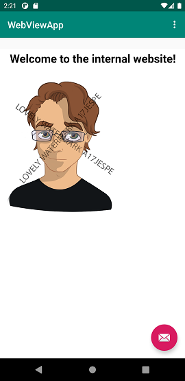

# Rapport

### By editing the following string in strings.xml I can change the name of my app.

``` <string name="app_name">WebView_Assignment_2</string> ```

### Adding the following line of code adds the utilization of a permission which in turn grants the app access to the internet.

``` <uses-permission android:name="android.permission.INTERNET"/> ```

### By swapping out TextView with a WebView element I can enable webpage access for future use.


### Through utilization of the following lines of code I can do the following:

 • Designate which webview to utilize:

            ```WebView my_WebView = findViewById(R.id.my_webview);```

 • Enable javascript for that webview:

           ```my_WebView.getSettings().getJavaScriptEnabled();```

 • And last, but not least, load an external URL:

            ```my_WebView.loadUrl("https://student.his.se");```


### To enable navigation to an internal and external page I added the previous lines of code to the respective if statement that are triggered upon activating the menu options.


External website:


            ```
            if (id == R.id.action_external_web) {

               WebView my_WebView = findViewById(R.id.my_webview); //Connects my_webview to the content webview ID
               my_WebView.getSettings().getJavaScriptEnabled(); //Enables javascript in my_WebView
               my_WebView.loadUrl("https://student.his.se"); // Loads external URL

           }
           ```


Internal website:


           ```
           if (id == R.id.action_internal_web) {

               WebView my_WebView = findViewById(R.id.my_webview); //Connects my_webview to the content webview ID
               my_WebView.getSettings().getJavaScriptEnabled(); //Enables javascript in my_WebView
               my_WebView.loadUrl("file:///android_asset/about.html"); // Loads internal HTML file

           }
           ```


### Here are the two pages


Internal:




External:


