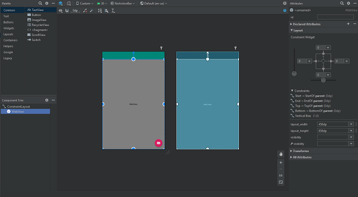

# Rapport

**Skriv din rapport här!**


1. By editing the following string in strings.xml I can change the name of my app.

``` <string name="app_name">WebView_Assignment_2</string> ```

2. Adding the following line of code adds the utilization of a permission which in turn grants the app access to the internet.

``` <uses-permission android:name="android.permission.INTERNET"/> ```

3. By swapping out TextView with a WebView element I can enable webpage access for future use.



4. Through utilization of the following lines of code I can do the following:

 • Designate which webview to utilize:

            ```WebView my_WebView = findViewById(R.id.my_webview);```

 • Enable javascript for that webview:

           ```my_WebView.getSettings().getJavaScriptEnabled();```

 • And last, but not least, load an external URL:

            ```my_WebView.loadUrl("https://student.his.se");```


5. To enable navigation to an internal and external page I added the previous lines of code to the respective if statement that are triggered upon activating the menu options.


External website:


```if (id == R.id.action_external_web) {

               WebView my_WebView = findViewById(R.id.my_webview); //Connects my_webview to the content webview ID
               my_WebView.getSettings().getJavaScriptEnabled(); //Enables javascript in my_WebView
               my_WebView.loadUrl("https://student.his.se"); // Loads external URL

           }```


Internal website:


           ```if (id == R.id.action_internal_web) {

               WebView my_WebView = findViewById(R.id.my_webview); //Connects my_webview to the content webview ID
               my_WebView.getSettings().getJavaScriptEnabled(); //Enables javascript in my_WebView
               my_WebView.loadUrl("file:///android_asset/about.html"); // Loads internal HTML file

           }```


_Du kan ta bort all text som finns sedan tidigare_.

## Följande grundsyn gäller dugga-svar:

- Ett kortfattat svar är att föredra. Svar som är längre än en sida text (skärmdumpar och programkod exkluderat) är onödigt långt.
- Svaret skall ha minst en snutt programkod.
- Svaret skall inkludera en kort övergripande förklarande text som redogör för vad respektive snutt programkod gör eller som svarar på annan teorifråga.
- Svaret skall ha minst en skärmdump. Skärmdumpar skall illustrera exekvering av relevant programkod. Eventuell text i skärmdumpar måste vara läsbar.
- I de fall detta efterfrågas, dela upp delar av ditt svar i för- och nackdelar. Dina för- respektive nackdelar skall vara i form av punktlistor med kortare stycken (3-4 meningar).

Programkod ska se ut som exemplet nedan. Koden måste vara korrekt indenterad då den blir lättare att läsa vilket gör det lättare att hitta syntaktiska fel.

```
function errorCallback(error) {
    switch(error.code) {
        case error.PERMISSION_DENIED:
            // Geolocation API stöds inte, gör något
            break;
        case error.POSITION_UNAVAILABLE:
            // Misslyckat positionsanrop, gör något
            break;
        case error.UNKNOWN_ERROR:
            // Okänt fel, gör något
            break;
    }
}
```

Bilder läggs i samma mapp som markdown-filen.


Läs gärna:

- Boulos, M.N.K., Warren, J., Gong, J. & Yue, P. (2010) Web GIS in practice VIII: HTML5 and the canvas element for interactive online mapping. International journal of health geographics 9, 14. Shin, Y. &
- Wunsche, B.C. (2013) A smartphone-based golf simulation exercise game for supporting arthritis patients. 2013 28th International Conference of Image and Vision Computing New Zealand (IVCNZ), IEEE, pp. 459–464.
- Wohlin, C., Runeson, P., Höst, M., Ohlsson, M.C., Regnell, B., Wesslén, A. (2012) Experimentation in Software Engineering, Berlin, Heidelberg: Springer Berlin Heidelberg.
